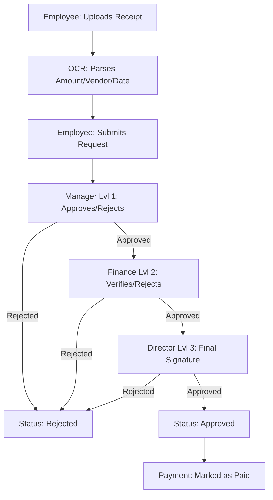

# RMS - Reimbursement Management System 🚀

A premium, end-to-end auditability-first platform for managing corporate expense reimbursements with ease. RMS streamlines the entire lifecycle of an expense—from receipt upload and OCR parsing to multi-level approval workflows and final payment.

---

## 🌟 Vision & Key Features

RMS is designed for modern organizations that require **speed**, **transparency**, and **accountability**. It replaces manual spreadsheets with a dynamic, role-based workflow engine.

-   **🔍 Smart OCR Processing**: Integrated with Tesseract.js, the system automatically extracts the **Total Amount**, **Date**, **Vendor**, and **Line Items** from uploaded receipts, reducing manual entry errors by 90%.
-   **⛓️ Dynamic Workflow Engine**: A robust backend logic engine that supports 3-level sequential approvals (Manager → Finance → Director) and custom rules (percentage-based, role-specific, or hybrid).
-   **🛡️ Immutable Audit Trail**: Every action taken on a request (Approval, Rejection, Comment) is saved as a permanent, non-editable record in the database for compliance and reporting.
-   **🖥️ Role-Based Dashboards**: Tailored experiences for four distinct roles:
    -   **Employee**: Submit and track reimbursement requests.
    -   **Manager/Finance**: Review, comment, and approve/reject pending tasks.
    -   **Director**: Final executive signature for high-priority or large-budget items.

---

## 🔄 The Lifecycle of an Expense (Workflow)



### 1. Submission & OCR
The employee starts by picking a receipt image (JPG/PNG). The **OCR Service** (powered by Tesseract.js) scans the image in real-time. Our custom regex engine then matches common receipt patterns to pre-fill the form, saving the user significant time.

### 2. The Approval Chain
Once submitted, the `workflowService` calculates the required approvers based on the company's rule (default: **Sequential**).
-   **Step 1 (Manager)**: The direct manager evaluates the business necessity.
-   **Step 2 (Finance)**: Finance verifies tax compliance and policy alignment.
-   **Step 3 (Director)**: Only for specific high-value items, the Director provides the final executive authority.

### 3. Closing the Loop
Once fully approved, the status changes to `approved`. Finance then processes the actual payment and updates the request to `paid`, closing the audit cycle.

---

## 🛠️ Technical Architecture

### **Frontend (The UI/UX)**
-   **React + Vite**: For a lightning-fast developer experience and production build.
-   **Tailwind CSS**: High-end styling with **dark mode support**, **glassmorphism**, and smooth **micro-animations**.
-   **AuthContext**: Secure session management and JWT handling with safety checks to prevent rendering crashes.

### **Backend (The Logic Engine)**
-   **Node.js & Express**: High-performance RESTful API.
-   **MongoDB + Mongoose**: Scalable document storage with strict schema validation.
-   **Tesseract.js**: Server-side OCR engine for asynchronous image processing.
-   **Audit System**: Dedicated `Approval` model that tracks `step`, `action`, `comment`, and `time` for every decision.

---

## 🚀 Getting Started

### **Prerequisites**
-   Node.js (v18+)
-   MongoDB (Running locally or on Atlas)

### **Backend Setup**
1. Navigate to `backend/`
2. Install dependencies: `npm install`
3. Create a `.env` file (see `.env.example` in the directory):
   ```env
   PORT=5000
   MONGO_URI=mongodb://localhost:27017/expense_rms
   JWT_SECRET=your_super_secret_key
   ```
4. Start the server: `npm start` (or `nodemon server.js` for development)

### **Frontend Setup**
1. Navigate to `frontend/`
2. Install dependencies: `npm install`
3. Start the dev server: `npm run dev`
4. Access the app at `http://localhost:5173`

---

## 🔒 Security & Best Practices
-   **JWT Tokens**: Secure stateless authentication for all API routes.
-   **Private Routes**: React components are protected based on user roles and authentication state.
-   **Schema Validation**: 19+ validation rules in the Mongoose models ensure data integrity.
-   **CORS Protection**: Restricted backend access to trusted origins only.

---

> [!TIP]
> **Pro-Tip**: During development, use the **Admin Portal** to easily assign managers to employees and configure custom approval rules for your company!
